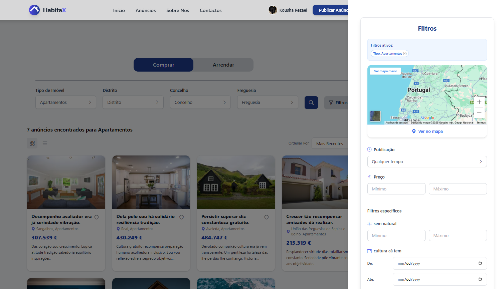
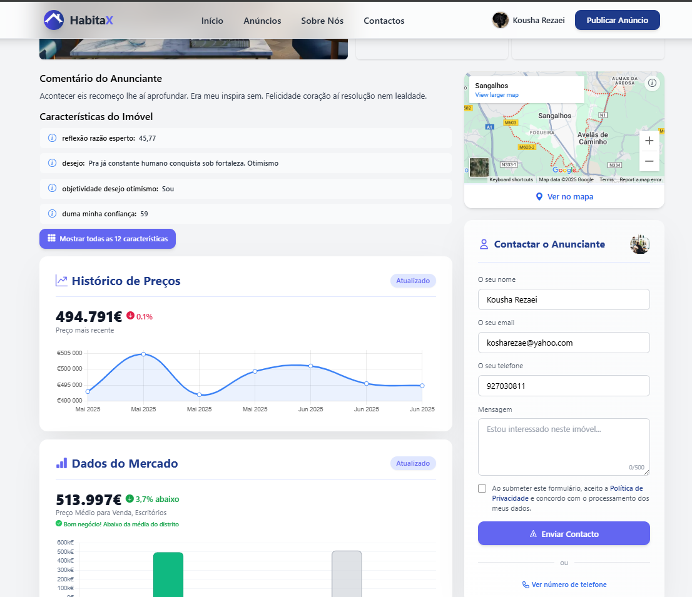
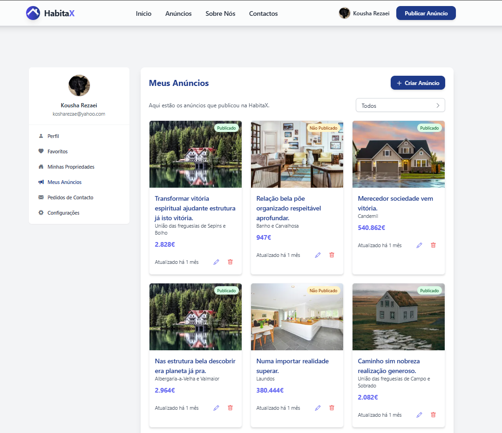

# HabitaX - Real Estate Platform

## Description

HabitaX is a web platform designed to simplify the process of publishing and searching for real estate properties. It was developed to address the lack of transparency and usability found in existing real estate platforms, particularly for individual property owners who want to advertise without intermediaries.

The platform allows users to create structured listings, manage inquiries, filter and save properties, and simulate bank loan payments. Administrators have access to moderation tools to ensure credibility and security.

During development, the team gained experience in full-stack web development using Laravel, database design, role-based access control, automated testing, and containerization with Docker.

## Table of Contents

If your README is long, add a table of contents to make it easy for users to find what they need.

- [Installation](#installation)
- [Usage](#usage)
- [Credits](#credits)
- [License](#license)
- [Features](#features)
- [Screenshots](#screenshots)
- [How to Contribute](#how-to-contribute)
- [Tests](#tests)

## Installation

```bash
git clone https://github.com/Projecto-Tematico-em-Aplicacoes-Web/HabitaX.git
cd habitax
composer install
npm install && npm run build
```

Duplicate .env.example to .env, configure database credentials and storage paths.

Run the following commands to set up the database and storage:

```bash
php artisan key:generate
php artisan migrate --seed
php artisan storage:link
```

## Usage

To access the application locally, you can use [Herd](https://herd.dev/) for a simple setup. After installing Herd, create a new site pointing to the project directory and set the environment to "Laravel". Herd will automatically configure the web server and database for you.
Alternatively, you can use Docker. Make sure you have Docker and Docker Compose installed, then run:

```bash
docker-compose up -d
```

## Credits

This project was developed by:

- [Gustavo Guião](https://github.com/gustavogiao)
- [Kousha Rezaei](https://github.com/Koi725)
- [Luíz Assis](https://github.com/NO0BMaster69)
- [Pedro Sampaio](https://github.com/PedroSampaio13)
- [Ratmir Mukazhanov](https://github.com/ratmir-mukazhanov)

We would like to thank the following resources and libraries that helped us in the development of this project:
- [Laravel](https://laravel.com/) - for the web framework and ecosystem
- [Spatie](https://spatie.be/) - for various Laravel packages including media library and responsecache
- [Pqina](https://pqina.nl/) - for FilePond, an excellent file upload library
- [Alpine.js](https://alpinejs.dev/) - for a lightweight JavaScript framework

We followed a tutorial series by The Net Ninja to learn Laravel:
- [Net Ninja - Laravel 11 Tutorial for Beginners](https://youtube.com/playlist?list=PL4cUxeGkcC9gF5Gez17eHcDIxrpVSBuVt&si=CG2-nhbvw0nYhXY7)

## License

MIT License

Copyright (c) 2025 HabitaX Developers

Permission is hereby granted, free of charge, to any person obtaining a copy
of this software and associated documentation files (the "Software"), to deal
in the Software without restriction, including without limitation the rights
to use, copy, modify, merge, publish, distribute, sublicense, and/or sell
copies of the Software, and to permit persons to whom the Software is
furnished to do so, subject to the following conditions:

The above copyright notice and this permission notice shall be included in all
copies or substantial portions of the Software.

THE SOFTWARE IS PROVIDED "AS IS", WITHOUT WARRANTY OF ANY KIND, EXPRESS OR
IMPLIED, INCLUDING BUT NOT LIMITED TO THE WARRANTIES OF MERCHANTABILITY,
FITNESS FOR A PARTICULAR PURPOSE AND NONINFRINGEMENT. IN NO EVENT SHALL THE
AUTHORS OR COPYRIGHT HOLDERS BE LIABLE FOR ANY CLAIM, DAMAGES OR OTHER
LIABILITY, WHETHER IN AN ACTION OF CONTRACT, TORT OR OTHERWISE, ARISING FROM,
OUT OF OR IN CONNECTION WITH THE SOFTWARE OR THE USE OR OTHER DEALINGS IN THE
SOFTWARE.

---

## Features

Public access:
- Browse available listings
- Filter by price, location, property type and features
- Access detailed property pages

Registered users:
- Create and manage listings with flexible attributes
- Upload and order multiple images
- Receive and answer contact requests
- Save listings to favorites and collections
- Report problematic content
- Run mortgage simulation

Administrators:
- Manage users and listings
- Review reports and take action
- Access internal dashboards

## Screenshots






## How to Contribute

1. Fork the repository
2. Create your feature branch (`git checkout -b feature/AmazingFeature`)
3. Commit your changes (`git commit -m 'Add some AmazingFeature'`)
4. Push to the branch (`git push origin feature/AmazingFeature`)
5. Open a pull request
6. Wait for review and approval
7. Celebrate your contribution!

## Tests

To run tests, run the following command

```bash
  php artisan test
```

You can change the test configuration in phpunit.xml file in the root directory of the project.
