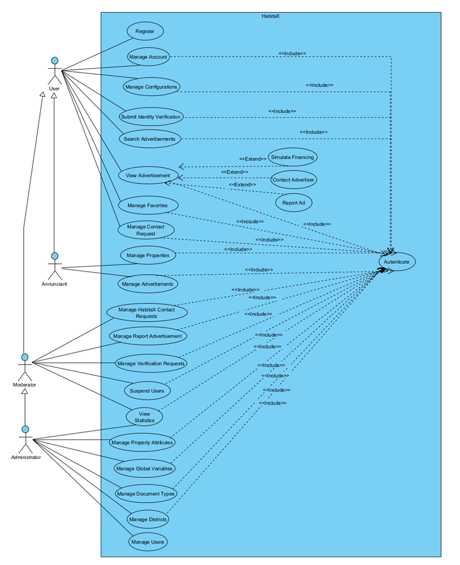
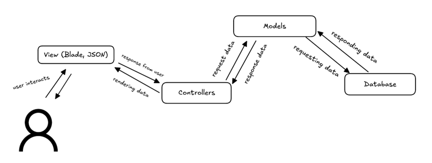
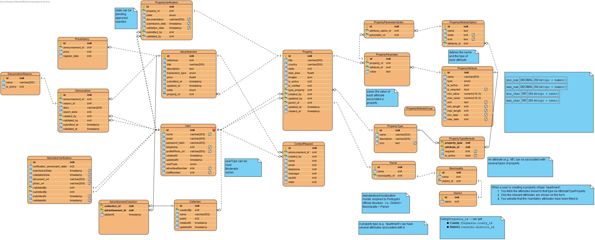
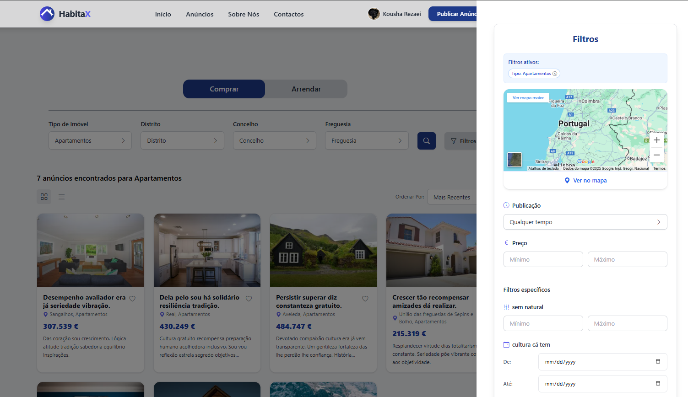
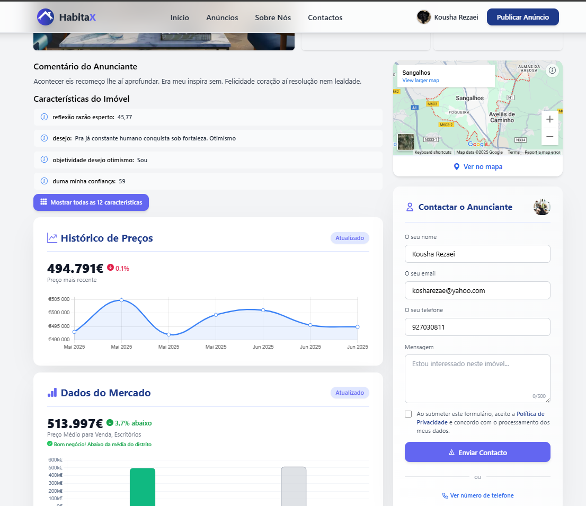
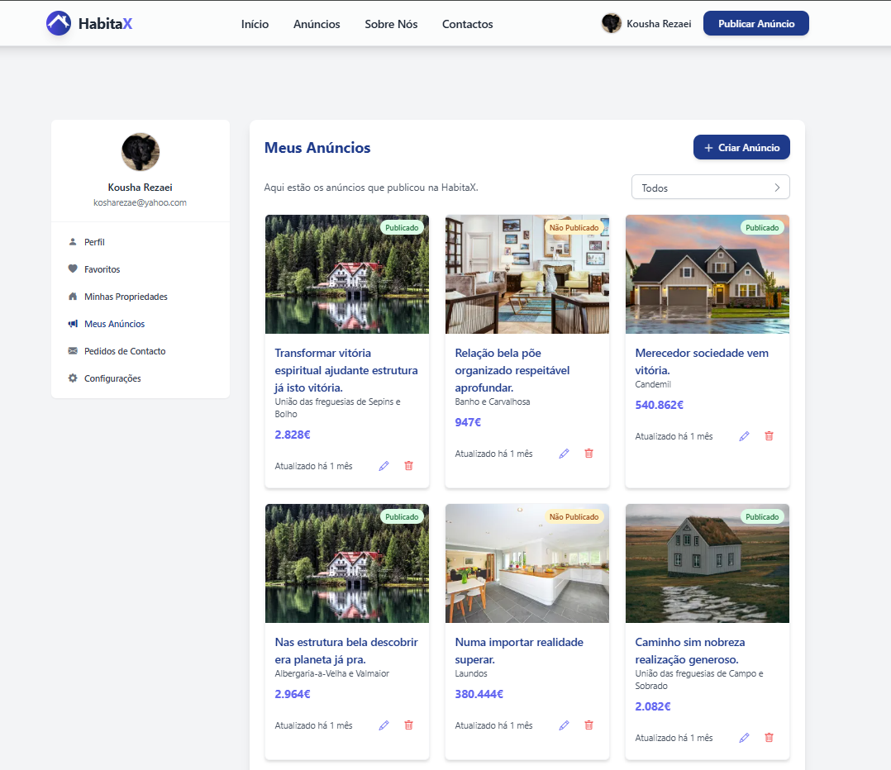

# HabitaX - Real Estate Platform

## Description

HabitaX is a web platform for publishing and searching real estate listings, developed as an academic project by a culturally diverse team of students based in Portugal, with backgrounds from Brazil, Kazakhstan and Iran.

Its core differentiator is a dynamic attribute engine: property types (e.g. apartments, land, commercial units) can define their own custom fields and metadata, so listings capture the right structure for each type without rigid, hardcoded schemas.

The platform supports structured listings, image galleries, contact request management, property saving and a mortgage-simulation tool. Administrators can moderate listings and users to preserve credibility.

The main technical challenge of the project was designing a flexible data model that allows new property types and custom fields to be introduced without modifying the database schema or codebase. To solve this, we implemented a polymorphic attribute storage system with validation rules, user-friendly forms and automatic rendering on the listing pages.

## Table of Contents

- [Features](#features)
- [Tech Stack](#tech-stack)
- [Architecture](#architecture)
    - [Use Cases](#use-cases)
    - [System Architecture](#system-architecture)
    - [Database Schema](#database-schema)
- [Screenshots](#screenshots)
- [Installation](#installation)
- [Usage](#usage)
- [Credits](#credits)
- [License](#license)
- [How to Contribute](#how-to-contribute)
- [Tests](#tests)

## Features

Public access:
- Browse available listings
- Filter by price, location, property type and specific features
- Access detailed property pages
- Run mortgage simulation
- Contact listing owners

Registered users:
- Create and manage listings with flexible attributes
- Upload and order multiple images
- Receive and answer contact requests
- Save listings to favorites
- Report problematic content

Administrators:
- Manage users and listings
- Manage property types and attributes
- Review reports and take action
- Access analytics and reports


## Tech Stack

- **Client:** Blade, TailwindCSS, JavaScript, JQuery, Alpine.js, FilePond
- **Server:** Laravel, PHP, PostgreSQL, Spatie packages
- **Dev Tools:** PhpStorm, Herd, Git, Visual Paradigm

## Architecture

### Use Cases
The main use cases of the application are illustrated below:



### System Architecture
The application follows the Model-View-Controller (MVC) architecture pattern, which separates the application logic into three interconnected components:



### Database Schema
The database schema is designed to support the dynamic attribute system and other core functionalities:



## Screenshots

The following screenshots showcase various parts of the application:







## Installation

```bash
git clone https://github.com/PTAW-2025-Group-3/HabitaX
cd habitax
composer install
npm install && npm run build
```

Duplicate .env.example to .env, configure database credentials and storage paths.

Run the following commands to set up the database and storage:

```bash
php artisan key:generate
php artisan migrate --seed
php artisan storage:link
```

> Note: The project was developed to run locally without requiring containerization. A docker-compose.yml is included for convenience and optional local testing, but using Docker is not required for normal local development.

## Usage

The project can be run locally using a simple PHP + webserver + DB setup. For convenience we recommend:

- [Herd](https://herd.dev/) (easy local setup for Laravel) — point Herd to the project directory and choose the Laravel environment; Herd will configure a web server and database automatically.

Optional Docker usage
- A docker-compose.yml is provided for developers who prefer a containerized local environment. Using Docker is optional — the application itself does not depend on Docker as a runtime requirement. Make sure you have Docker and Docker Compose installed, then run:

```bash
docker-compose up -d
```

## Credits

This project was developed by:

- [Gustavo Guião](https://github.com/gustavogiao)
- [Kousha Rezaei](https://github.com/Koi725)
- [Luíz Assis](https://github.com/NO0BMaster69)
- [Pedro Sampaio](https://github.com/PedroSampaio13)
- [Ratmir Mukazhanov](https://github.com/ratmir-mukazhanov)

During development the team gained hands-on experience with Laravel, practical database modeling for flexible data (dynamic attributes), role-based access control and automated testing.

Special thanks to [Professor Rui Isidro](https://www.linkedin.com/in/ruiisidro/) for suggesting the dynamic attributes concept and for his guidance throughout the project.

We would like to thank the following resources and libraries that helped us in the development of this project:
- [Laravel](https://laravel.com/) - for the web framework and ecosystem
- [Spatie](https://spatie.be/) - for various Laravel packages including media library and responsecache
- [Pqina](https://pqina.nl/) - for FilePond, an excellent file upload library
- [Alpine.js](https://alpinejs.dev/) - for a lightweight JavaScript framework

We followed a tutorial series by The Net Ninja to learn Laravel:
- [Laravel 11 Tutorial for Beginners](https://youtube.com/playlist?list=PL4cUxeGkcC9gF5Gez17eHcDIxrpVSBuVt&si=CG2-nhbvw0nYhXY7)

## License

This project is licensed under the MIT License.

Consult the [`LICENSE`](licence.txt) file for more details.

## How to Contribute

1. Fork the repository
2. Create your feature branch (`git checkout -b feature/AmazingFeature`)
3. Commit your changes (`git commit -m 'Add some AmazingFeature'`)
4. Push to the branch (`git push origin feature/AmazingFeature`)
5. Open a pull request
6. Wait for review and approval
7. Celebrate your contribution!

## Tests

To run tests, run the following command

```bash
  php artisan test
```

You can change the test configuration in phpunit.xml file in the root directory of the project.
