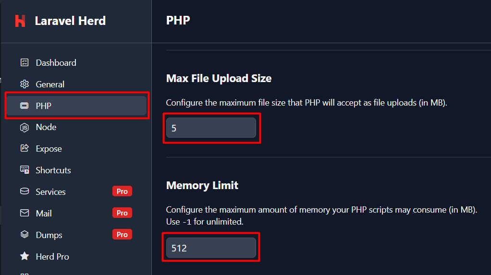

# Como rodar site depois da implementação das imagens

Geração dos dados
---------------------------
Nesta altura, as propriedades já tem imagens em forma de ficheiros.
Antes de fazer seeding, é necessário:
- Adicionar imagens
  - Criar pasta "property-seed-images" na pasta storage 
  - Encher pelo menos 10 com imagens da sua escolha (mais - melhor).
  - Ratmir pode partilhar zip com imagens das casas.
- Ajustar PropertySeeder
  - por exemplo se é preciso gerar muitos dados para **testar pesquisa**,
  - deixar $count = 1 para resuzir quantidade das imagens por propriedade
- Finalmente rodar o comando:
```sh
  php artisan migrate:fresh --seed
```

Definições do ambiente
--------------------------
Para que não houve erros na inserção e processão das imagens, 
é necessário aumentar limites certos nas definições do PHP no Herd:
- Tamanho máximo de upload: pelo menos 5MB
- Limite de memória: pelo menos 512MB



> Mesmo assim, o desempenho do site pode ser afetado
com carregamento constante das imagens em qualidade inteira.
Por isso implementamos um sistema para gerar thumbnails e previews das imagens,
que são gerados após a inserção das imagens.

Para ligar pode **escolher uma das seguintes opções**:

- Editar ficheiro .env
   - mudar ***QUEUE_CONNECTION=database***
   - para ***QUEUE_CONNECTION=sync***


- Opção preferida:
```sh
  php artisan queue:work
```
Rodar num terminal separado enquanto desenvolvimento (como <i>npm run dev</i>):

Notas finais
----------------------
> Tentem excluir Seeders dos seus commits, para cada um ficar 
com a versão propria ajustada para propósitos específicos.
Comando **git stash** e **git stash pop** pode ajudar 
guardar alterações locais não submetidas num commit.

Bom trabalho a todos maltinha!
